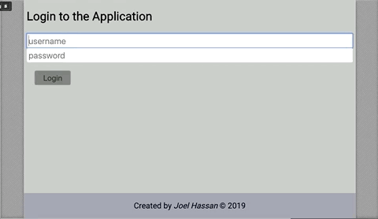

# Bloglist Application ✍

This is a simple full-stack application where a user can:

- login with credentials
- list blog posts/articles
- like/remove the posts
- view a list of the blogs/users who added them

Although limited, the app features a bunch of technologies, including:

Front-End:

- React/React-Router
- Redux for State Management
- CSS - Styled Components
- Jest for Integration Testing
- Cypress for E2E Testing

Back-End

- Node/Express
- MongoDB/Mongoose
- JWT fort User Authentication
- Jest for Testing

Demo of Cypress running some tests:

